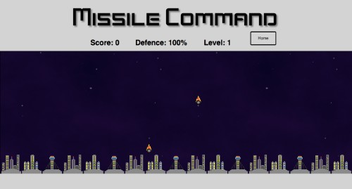
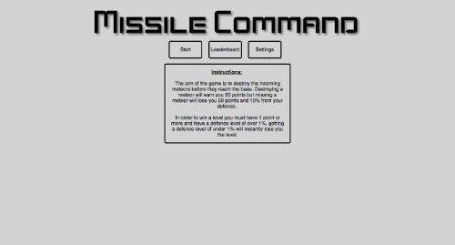
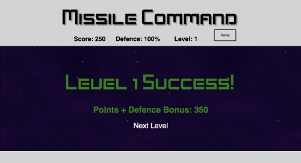
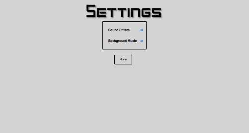

# Sparta Game Project: Missile Command

## Demo & Downloading this game
To play this game [Click Here](https://wmichael.github.io/missile-command-sparta-game/).

If you want to download this game please click on the "Clone or Download" button that looks like this:

It will allow you to clone this repository.

## Missile Command game for my Sparta Game Project
This is a HTML5 / JS / CSS game. The idea of this game came from the old Atari game of the same name.

The purpose of the game is to be quick enough to destroy the increasingly fast incoming meteors that are heading for the home base.

Here is the [Rough plan](docs/roughPlan.pdf) for the game.

## How to Play
To destroy the meteors you have to left-click on them. Destroying a meteor will earn you 50 points but missing a meteor will lose you 50 points and 10% from your defence.

In order to win a level you must have 1 point or more and have a defence level of over 1%, getting a defence level of under 1% will instantly lose you the level. Your defence will be added onto your score at the end of each level i.e 80% Defence will give you 80 points.

## Functionality
The game uses many divs over one page these divs represent different views of the game e.g home, game, leaderboard and settings. When one div is shown then all other divs are hidden.

This is the home screen shown upon loading the game. It gives you some instructions on how to play and also the buttons that link to the other views.

The game consists of multiple levels each with increasingly lower times between meteors and increasingly higher speeds and amounts of meteors. A 2D Array is used to hold the information for each level including the amount of meteors, speed and time between each meteor.

The game has a leaderboard which takes the score from a previous game. These scores are shown in descending order with the player's name. The game uses HTML5 web storage in order to store the leaderboard array. After each game is played, the game will store the player score and name into the JS array and will also store this into the Local Storage of the Browser. When loading the website, the website will retrieve the array if it's there and set it as the leaderboard array.

The settings of the game allows you to control whether you want to have sound effects turned on or not. The option for background music is also there but background music hasn't currently been added to the game yet.

### Sounds
I used sound effects in my game these include:
- Explosion sound [https://freesound.org/people/Omar%20Alvarado/sounds/199725/](https://freesound.org/people/Omar%20Alvarado/sounds/199725/)
- Win sound [https://freesound.org/people/unadamlar/sounds/341984/](https://freesound.org/people/unadamlar/sounds/341984/)
- Lose sound [https://freesound.org/people/josepharaoh99/sounds/364929/](https://freesound.org/people/josepharaoh99/sounds/364929/)

### Other JS Scripts
- JQuery

### Fonts
- Kenney Space font used for the header [https://www.1001fonts.com/kenney-space-font.html](https://www.1001fonts.com/kenney-space-font.html)

## Future Additions
- Add other falling objects e.g Aliens, Defence Boosts
- Animations to show missiles hitting the target
- Missile explosions that hit other nearby meteors.
- More levels to play on.

## Current issues
- Sometimes meteors will spawn at the top of the game but will be stuck. This will cause the user to lose points/defence and possibly lose the level.
